---
header-includes:
  - \usepackage{enumitem}
  - \setlistdepth{20}
  - \renewlist{itemize}{itemize}{20}
  - \renewlist{enumerate}{enumerate}{20}
  - \renewlist{description}{description}{20}
  - \setlist[itemize]{label=\textbullet}
  - \usepackage{titlesec}
  # Make Markdown headings more distinct
  - \titleformat{\section}
      {\sffamily\Large\bfseries}   % style for # (section)
      {\thesection}                % section number
      {0.8em}                      % space between number and text
      {}
  - \titleformat{\subsection}
      {\sffamily\large\bfseries}   % style for ## (subsection)
      {\thesubsection}
      {0.8em}
      {}
  - \titleformat{\subsubsection}
      {\sffamily\normalsize\bfseries}
      {\thesubsubsection}
      {0.8em}
      {}
  # Optional: extra space before/after headings
  - \titlespacing*{\section}{0pt}{2ex plus 1ex minus .2ex}{1ex}
  - \titlespacing*{\subsection}{0pt}{1.5ex plus 1ex minus .2ex}{0.8ex}
  - \titlespacing*{\subsubsection}{0pt}{1ex plus .5ex minus .2ex}{0.5ex}
geometry: margin=1in
---

<h1>
Classical vs RL Pricing for Perishable Inventory under Stochastic Demand
</h1>

**Student name:** Joshua Walter
**Student ID:** 14296418
**Supervisor:** Haoyu Liu
**Degree/Subject code:** 41030

---

<h2>
Executive Summary
</h2>

This report explores the differences between classical and reinforcement learning (RL) pricing policies for a single perishable product under stochastic, price-sensitive demand. 

With increased pressure on retailers to manage thin margins while simultaneously reducing expired units and meeting changing customer demand, a configurable simulation environment is developed to model a finite horizon with perishable units, capturing stockouts, ageing inventory, and disposal.

The simulation environment is accessible to both users through an interactive gamified website and as a Python Gym wrapper for evaluation with various inventory management policies. These policies include: simple FixedPricePolicy, MyopicGreedyPolicy, ThresholdRestockPolicy, MarkdownExpiryPolicy, SellThroughRHPolicy, NewsvendorPolicy and an RL policy (PPO).

Each policy is compared across 100 simulated episodes for two distinct perishable product configurations and captures key performance indicators, including total profit, waste, unmet demand, and profit variability, to evaluate the trade-offs each policy makes to achieve maximum profit.

For both product configurations, the highest-profit policies are horizon-aware, state-dependent policies such as NewsvendorPolicy, MyopicGreedyPolicy, SellThroughRHPolicy, and PPO, which significantly outperform static policies that cannot dual-control price and inventory levels.

Ultimately, while the fixed-price policies drove sales up, they resulted in negative profits; conversely, high prices reduced demand and increased waste. Unlike these policies, the PPO agent could match the top classical heuristics when measuring by mean profit and risk. In addition, the PPO policy provides flexibility to target specific performance indicators, such as reducing waste and prioritising unmet customer needs. 

The report concludes that for retailers managing perishable inventories, implementing a policy that can adapt dual price and inventory control policies is a high priority. Furthermore, implementing a simulated environment that replicates the retailer's own selling environment provides a promising opportunity to train RL policies that can complement classic heuristics, especially when fine-tuning and higher customisation is necessary.

---

<h2>
Table of Contents
</h2>
<!-- TOC -->

- [Introduction](#introduction)
    - [Problem Definition](#problem-definition)
    - [Objectives](#objectives)
    - [Scope and Limitations](#scope-and-limitations)
- [Literature Review](#literature-review)
- [Method](#method)
    - [Simulation Environment Design](#simulation-environment-design)
        - [Overview](#overview)
        - [MDP](#mdp)
        - [Dynamics & Daily Lifecycle](#dynamics--daily-lifecycle)
        - [Implementation](#implementation)
        - [Testing, Verification & Validation](#testing-verification--validation)
    - [Policies Design](#policies-design)
        - [Overview](#overview)
        - [Policy Implementation / Pseudocode](#policy-implementation--pseudocode)
        - [Testing, Verification & Validation](#testing-verification--validation)
    - [Environment Repeatability](#environment-repeatability)
    - [Procedures Step-by-Step](#procedures-step-by-step)
    - [Tools, Software](#tools-software)
- [Results](#results)
    - [Perishable Type A](#perishable-type-a)
    - [Perishable Type B](#perishable-type-b)
- [Discussion](#discussion)
    - [Results Discussion](#results-discussion)
    - [User Manual](#user-manual)
    - [Overview](#overview)
    - [Starting the Simulation](#starting-the-simulation)
    - [Implications](#implications)
    - [Limitations & Challenges](#limitations--challenges)
    - [Ethics & sustainability](#ethics--sustainability)
- [Conclusion and Recommendations](#conclusion-and-recommendations)
- [Communication Plan](#communication-plan)
- [References](#references)
- [Use Of AI In this report](#use-of-ai-in-this-report)
- [Appendices](#appendices)

<!-- /TOC -->

---

## 1. Introduction

The food retail industry is a highly integral part of society, where sectors that produce fresh produce, such as meat, dairy, and other organics, are a key pillar of its operations. Even today, perishability remains one of the most challenging constraints to manage in inventory management. As time passes, quality degrades, and the expiration of products produces waste and losses, cutting into margins and harming the environment. While large portions of waste are generated by end consumers, over a quarter of the food supply is lost within the food supply chain (Kummu et al., 2012). Resources sunk into producing food that is wasted along the supply chain account for 6% of global CO2 emissions (Poore & Nemecek, 2018), reducing margins. Retail waste is predominantly an operational issue where causes of food waste are related to inefficient store operations and replenishment policies (Teller et al., 2018). Small margins exacerbate the effect of waste. Margins of grocery retailers are usually 2–3% so by reducing food waste they can double their profit margins (Riesenegger & Hübner, 2022). Additionally, large retailers in Australia, such as Coles and Woolworths, have moved to reduce waste by 13% (Hayward, 2025), highlighting the importance of this issue to retailers. However, maintaining profit when dealing with a perishable inventory is not as simple as cutting down on waste; it instead relies on smart economic controls that can integrate pricing decisions with inventory.

While reducing waste is crucial for retailers, price is one of the most effective variables managers can manipulate to encourage or discourage demand in the short run (Bitran & Caldentey, 2003), thereby reducing waste and improving profitability. Many retailers rely on simple pricing policies for their inventory. The Fixed Price Policy maintains a static price over a finite horizon, making it easy to implement and potentially competitive when inventory and demand exhibit slight variance. Inventory Band Pricing Policy maps inventory levels to prices, leading to state-dependent decisions, but struggles with demand and stock discrepancies. Where static policies struggle to remain competitive, dynamic pricing reduces waste by 21% while increasing the chain’s gross margins by 3% (Sanders, 2023). Markdown Policy is a dynamic pricing policy that relies on deeper discounts as items near expiry; however, it may result in under- or over-discounts when dealing with high stock variances. Myopic Greedy Policy chooses a price that maximises the immediate profit given the current inventory state, ignoring subsequent steps in the episode, which may result in high end-of-horizon waste. Many retailers choose to utilise these policies because they are cheap to run, robust and straightforward to implement. However, they do not utilise the coupling between demand, inventory and forecasting. A successful policy must respond in real time to changing inventory states and demand signals; otherwise, retailers risk lost sales, overstocking, or eroded profit. While maximising profit is the primary indicator of a successful policy, it is equally important that a policy can respond to social issues.

The motivation of this paper stems from the problem's importance and relevance to almost all firms that manage inventories of perishable items. While much of the existing research models perishable inventory and stochastic demand as separate factors due to the complexity and lack of computer-aided models, there is now a significant gap in using advanced algorithms to develop strategies that optimise pricing and replenishment decisions across multiple periods. This research paper seeks to analyse how cutting-edge RL dynamic pricing strategies in multi-period perishable inventory systems under stochastic demand can compare to classical models.

### 1.1 Problem Definition
Consider a finite-horizon, multi-period inventory system that holds a single perishable product type with stochastic, price-sensitive demand. Each day, a policy adjusts the price and the order quantity to maximise profit at the end of the episode. The final profit is the cumulative daily profit, which accounts for restock, holding, expiration, and stockout costs. The problem is to compare classical policy classes against reinforcement-learning policies (e.g., PPO) on profit, service level (reducing unmet demand), and waste.

### 1.2 Objectives

**Aim**
To benchmark classical and RL pricing/inventory policies through simulation to produce data on profit, service level, and waste in multi-period perishable inventory under stochastic demand.

**Objectives**
1. Design and implement a simulated grocery environment for a single perishable SKU with stochastic, price and freshness‑sensitive demand.
2. Deploy the environment so users can interact with the system.
3. Train a PPO agent to output (price, replenish) actions each period; tune hyperparameters via reproducible experiments.
4. Implement the following policies to benchmark against:
- 1. **FixedPricePolicy** — Static pricing (constant price) + max-fill reorder
- 2. **MyopicGreedyPolicy** — Myopic one-period profit maximization
- 3. **ThresholdRestockPolicy** — (s, S) order-up-to policy (fixed price)
- 4. **MarkdownExpiryPolicy** — Markdown/clearance pricing heuristic (inventory/expiry-driven)
- 5. **SellThroughRHPolicy** — Rolling-horizon (MPC-style) sell-through / target DoC control
- 6. **NewsvendorPolicy** — Rolling newsvendor (service-level) with price grid (heuristic)
5. Compare PPO to the three baselines on profit, waste rate, stockout frequency, and margin volatility over $\ge 100$ episodes.
6. Report statistical significance of differences and provide actionable insights.

### 1.3 Scope and Limitations
**Scope:** Single perishable SKU at a time; single location; finite horizon with discrete age states and lost sales; stochastic, price-sensitive demand; immediate or fixed-lead replenishment; no substitution or competition; full price control within defined bounds. This design isolates policy effects and aligns with the objective of benchmarking policy classes under a consistent setting.

**Out of scope:** Multi-SKU interactions/cross-elasticities; multi-echelon supply chains or variable lead times; promotional calendars; strategic customer behaviour; and real-world deployment frictions (e.g., price-change limits, approval workflows).

---

## 2. Literature Review

**Foundational Models Approaches**
There is a consensus in the existing research that optimising dynamic pricing with inventory control can increase profit and reduce wastage when dealing with perishable items. Early frameworks introduced the concepts regarding dynamic pricing under uncertain demand (Gallego & van Ryzin, 1994; Zhao & Zheng, 2000); however, Keskin, Li and Song were able to further advance the existing theory by using data-driven methods that cover perishability more extensively by altering pricing and the ordering process based on environmental changes to increase profitability (Keskin et al., 2022). Elmaghraby and Keskinocak (2003) contribute to demand-driven pricing strategies for inventory systems through a comprehensive review that concluded that utilising dynamic pricing with inventory control can significantly outperform revenue performance when compared to static models, especially evident in uncertain demand (Elmaghraby & Keskinocak, 2003). Despite the consensus that dynamic pricing strategies with inventory control can generate more revenue than static models, a divergence between the research is evident in modelling assumptions. In some research, the perishability of items is assumed to be of constant deterioration (Nahmias, 1982), whereas other studies assume a limited fixed shelf-life where perishability does not affect the cost of the item; instead, it is disposed of at the end of its lifetime. Keskin, Li, and Song (2022) study perishable items in stochastic demand to create data-driven pricing & ordering policies. They test on supermarket data and calculate regret rates however, they acknowledge that in multi-period and changing environments, further work still needs to be done on adaptive models that link perishability to dynamic pricing. A gap is evident from the existing research - connecting perishability to dynamic pricing in a multi-period system needs further study, mainly through modelling that more accurately represents real-world factors.

**Modelling Demand Uncertainty**
At the core of modelling how dynamic pricing can affect revenue is how to approach uncertainty in demand. In the research work proposed by Ferreira, K., Simchi-Levi, D., & Stewart, H they propose a method of machine learning known as Thompson Sampling to understand the effects of uncertain demand parameters (Ferreira et al., 2015). Furthermore, additional papers attempt to model uncertainty in demand for discrete choice models in dynamic revenue strategies to understand how customers react (Talluri & van Ryzin, 2004). In other research, models attempt to learn from randomness and variability in demand using nonparametric learning algorithms that modify prices dynamically (Keskin et al., 2022), allowing for pricing systems to be able to adjust for unpredictable and evolving demand patterns in perishable inventory settings. In the case of airline pricing, uncertainty in demand has another layer of complexity - a behavioural element that introduces two sources of uncertainty: timing & price responsiveness. It is clear that in more theoretical research, demand can be modelled using more straightforward static functions. However, there is a divergence in methods for modelling between theoretical and practical demand. In practical settings, demand is treated with more nuance where it cannot be modelled using traditional methods. Instead, more cutting-edge methods are used to understand it. To handle the real-world complexity of demand, Jo, S., Lee, G. M., & Moon, I. propose using a reinforcement learning algorithm to learn from customer patterns instead of relying on fixed demand functions (Jo et al., 2024). Despite the research on understanding uncertainty in demand, there remains a gap in developing a scalable model that can adapt continuously in a scenario with perishability across multiple periods in uncertain demand.

**Machine Learning Approaches**
As technology continues to improve, machine learning has allowed dynamic pricing strategies to be more adaptive and flexible, using significantly more data points to accurately enhance revenue and reduce wastage of perishable products in multi-period situations. Nowak and Pawłowska-Nowak’s research proposes how machine learning can improve dynamic pricing using SVMs in e-commerce settings (Nowak & Pawłowska-Nowak, 2024). Additionally, research by Chen et al aims to understand how machine learning models can be used to predict optimal dynamic pricing strategies in a setting where uncertain demand exists (Chen et al., 2018). A limitation of using machine learning models is that it is not adaptable to new, emergent customer demand, which complex behaviour factors may influence. As a point of divergence in research, cutting-edge studies examine how reinforcement learning can understand complex factors to improve dynamic pricing strategies that previous machine learning models could not deal with. In the study done by Nomura et al, a deep reinforcement learning based approach is proposed. This paper explores how Proximal Policy Optimisation can maximise revenue through pricing optimisations and inventory restocking decisions. An essential consideration of this research is how this model can account for complex demand where customers may be more likely to change preferences based on shelf life and pricing, and demonstrate the potential to tune to different outcomes, such as reducing waste, increasing revenue (Nomura et al., 2025). Further use of reinforcement learning looks at how including Deep Q-Learning (DQL) can address the problems faced when modelling dynamic pricing and ordering problems for perishable products in uncertain demand. In Yavuz & Kaya’s research, deep reinforcement learning can outperform all traditional approaches in handling perishable products (Yavuz & Kaya, 2024). While cutting-edge research moves away from methods best suited to theoretical understanding of relating dynamic pricing to demand, there is still a gap in research when comparing how different types of advanced computer-aided learning, such as Machine Learning and Reinforcement Learning, can benefit this problem.

---

## 3. Method

This study adopts a simulation-based optimisation framework in which the problem is modelled as a finite-horizon Markov Decision Process (MDP) for perishable inventory under stochastic, price-sensitive demand. In this simulation, the dynamic pricing policies have been optimised, enabling the evaluation of each strategy under controlled uncertainty and perishability without resorting to extreme analytical simplifications. The success of a policy is computed by comparing the average end-of-horizon profit and the profit standard deviation with the optimal: high profit, low deviation = high reward, low risk; and the least optimal: low profit, high deviation = low reward, high risk. This method fits the research question, as the MDP explicitly encodes the trade-offs between ageing, lost sales, and expiring items across a finite horizon, enabling the testing and evaluation of different pricing policies.

### 3.1 Simulation Environment Design

#### 3.1.1 Overview
The simulation has been set up to enable a single perishable item type within a finite-horizon inventory system. Demand is stochastic, price-sensitive, and influenced by seasonal multipliers (e.g., weekends may see more or less demand than weekdays). Time is discrete (days), and at the start of each day, expired units are removed. For the benchmarks, two perishable item types were chosen (see Listing 5 & 6). These items were chosen to match the properties of a short life, high demand, low cost, and simplified properties such as no salvage costs. The policy being evaluated sets a selling price for the day and optionally restocks inventory. From this action, a random demand is generated, and sales are completed FEFO from the inventory. The day is then ticked to the next period, and the KPIs are recorded. This process will repeat until the environment terminates. The environment has been set up to be configurable, enabling the evaluation of different scenarios for item types, and includes reproducible randomness with a seed parameter.

#### 3.1.2 MDP

**Configuration**
- **Horizon** (`episode length`)
- **Shelf-life** (`expiration_days`)
- **Capacity**
- **Price bounds** \([p_{\min},\, p_{\max}]\)
- **Costs**: restock \(c_r\), holding \(c_h\)
- **Traffic**: weekly seasonality parameters and Gaussian noise level
- **Conversion model** (default: **log-normal WTP**)
- **Demand noise** (default: **Poisson**; Binomial / NegBin)

**Inputs**
- **Price**: \(p_t \in [p_{\min},\, p_{\max}]\).
- **Replenishment fraction**: \(r_t \in [0,1]\), mapped to an **order quantity** \(R_t\), capped by **`max_restock`** and **capacity**.

**Environment Variables / Outputs**
- **Horizon**: max_days \( \in \mathbb{N} \) (default 30)
- **Shelf Life:** expiration_days \( \in \mathbb{N} \) (default 5)
- **Initial Inventory Size:** initial_inventory (default 50)
- **Termination:** day \(\ge\) max_days
- **Day index:** t
- **Inventory:** [(day_created, qty)...]

**Stochastic drivers**
- **Daily visitors** \(V_t\): weekly seasonality + Gaussian noise
- **Demand noise model**: Poisson / Binomial / Negative Binomial

**Conversion model parameters**
- **WTP log-normal**
- **logitLogPrice**
- **elasticity**
- **linear**
- **exponential**

**Cost/price parameters**
- **Restock cost** \(c_r\)
- **Holding cost** \(c_h\)
- **Disposal** implicit via expiry
- **Optional penalties**:
  - **Stockouts**: \(\lambda_{\text{stockout}}\)
  - **Price jumps**: \(\lambda_{\Delta p}\)
  - **Disposal Cost**: \(\lambda_{\text{disposal}}\)

#### 3.1.3 Dynamics & Daily Lifecycle

> **Figure 1** Daily Simulation Flow for Pricing and Restocking


The simulation steps the day with the following steps (Figure 1):
1. Remove expired inventory and update last_expired.

2. Record opening inventory by age bucket.

3. Restock to capacity or by max_restock then update last_restocked.

4. Sample foot traffic (weekly seasonality + Gaussian noise); record last_foot_traffic.

5. Sample demand via conversion × noise model.

6. Fulfil sales FEFO; compute realised sales 𝑆𝑡St and unmet demand.

7. Compute revenue, costs, daily profit; update running KPIs.

8. Age remaining inventory; construct 𝑠𝑡+1st+1​.

9. Terminate if 𝑡≥𝑇 t≥T; else repeat.

#### 3.1.4 Implementation

> **Listing 1 - Simulation Config UI Wireframe**

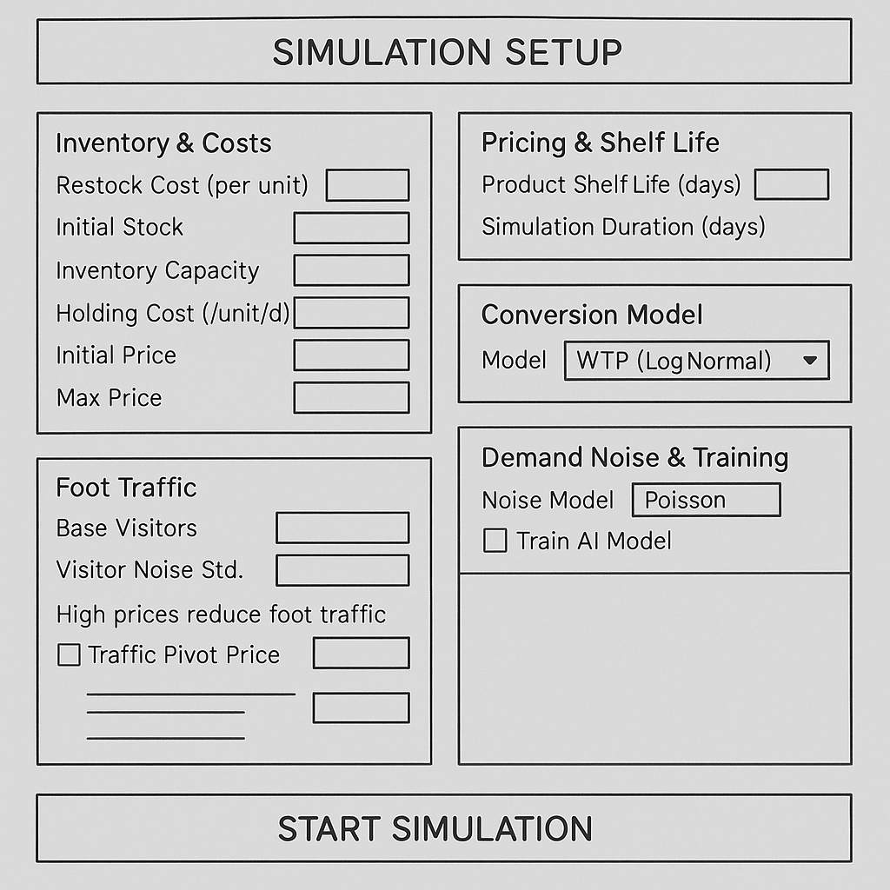
The setup screen is the game's introduction. This screen breaks the simulation config into logical panels (inventory, traffic, conversion, noise, AI training). This panel will leverage React's features to keep components reusable and upgradeable. Each control will be wired to its own useState hook, enabling a user to map the UI to SimulationConfig easily. Demand behaviour is modelled flexibly using multiple conversion and noise models, with shared calibration parameters and helper functions such as convAtPrice, normalInvCDF.
Additionally, the ConversionChart will provide a live preview of the price–conversion curve as the user tweaks inputs. The UI is planned to show off a playful, arcade-style Tailwind design. At the same time, handleStart cleanly aggregates all states into a single demandConfig passed to onStart.

> **Listing 2 - Simulation UI Daily Screen for Testing**

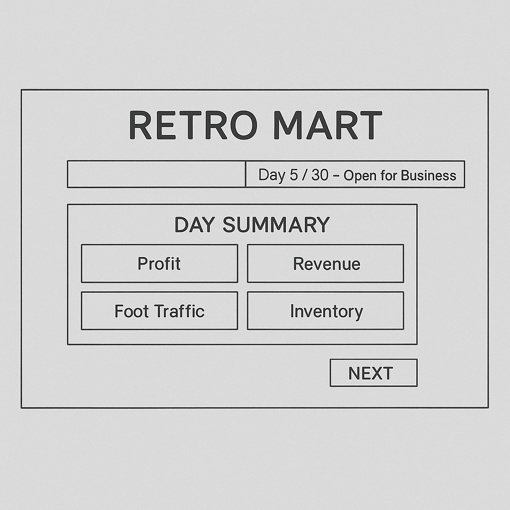
The day screen panel will pipe the current day’s metrics (profit, foot traffic, holding/restock costs, price, etc.) into a reusable KPISection component. A single “NEXT” button will advance to the following screen. At the same time, the optional EpisodeOverOverlay can appear when done is true, so the player sees the final results before continuing.

> **Listing 3 - Simulation UI Night Screen for Testing**


The night view will include a left column for the restock/price sliders, an AIRecommendationCard, a middle column visualising inventory batches, and a right column of sales, revenue, and conversion charts, all fed directly from history and props.

#### 3.1.5 Testing, Verification & Validation
- 1. A gamified UI was created that allows users to interact with the environment the same way that the policies do to catch edge cases and bugs
- 2. Unit testing was implemented 1. Test both edge cases and standard functionality after any changes have been made. 2. After a bug was discovered, ensure that it does not return.
- 3. Environment was 'seeded' each run to ensure results could be reproduced.

### 3.2 Policies Design

#### 3.2.1 Overview
The following policies were implemented: (i) Myopic + Fixed Replenishment & Sell through, (ii) Rules-based Markdown, (iii) Newsvendor-inspired and PPO.

#### 3.2.2 Policy Implementation / Pseudocode

**PPOPolicy**
```
load PPO model (and optional VecNormalize stats)

on act(obs):
    if using VecNormalize:
        o = normalize(obs)
    else:
        o = obs
    action = PPO_model.predict(o, deterministic=True)
    return action  # [price, restock_frac]
```

**FixedPricePolicy**
```
given: fixed_price

on act(obs, env):
    price = clamp(fixed_price, env.price_min, env.price_max)
    restock_frac = 1.0  # always restock aggressively (fill-to-cap)
    return [price, restock_frac]
```

**MyopicGreedyPolicy**
```
given: price_grid_step

on act(obs, env):
    opening_inventory = current_inventory
    capacity_left     = capacity - opening_inventory
    best_profit = -∞
    best_price  = price_min
    best_restock_units = 0

    for each price p in [price_min .. price_max] with step price_grid_step:
        expected_demand = expected_demand_today(env, p)   # traffic * conversion
        needed_units    = max(0, expected_demand - opening_inventory)
        restock_units   = clamp(ceil(needed_units), 0, min(max_restock, capacity_left))

        expected_sales  = min(opening_inventory + restock_units, expected_demand)
        expected_profit = p * expected_sales - restock_cost * restock_units

        if expected_profit > best_profit:
            update best_price, best_profit, best_restock_units

    restock_frac = best_restock_units / max_restock
    return [best_price, restock_frac]
```

**ThresholdRestockPolicy**
```
given: fixed_price, s_threshold, S_target

on act(obs, env):
    price = clamp(fixed_price, price_min, price_max)
    inventory = current_inventory
    capacity_left = capacity - inventory

    if inventory < s_threshold:
        target_add = S_target - inventory
        restock_units = clamp(target_add, 0, min(max_restock, capacity_left))
    else:
        restock_units = 0

    restock_frac = restock_units / max_restock
    return [price, restock_frac]
```

**MarkdownExpiryPolicy**
```
given:
    base_price p0
    target_inventory_fraction
    k_inv (how strongly price reacts to inventory gap)
    k_exp (how strongly price reacts to expiry pressure)
    k_dow (optional weekday sinusoidal tweak)
    optional target_inventory_units

on act(obs, env):
    inv_frac     = obs[inv_frac_feature]
    expiry_press = obs[expiry_pressure_feature]
    dow_sin      = obs[dow_sin_feature]

    # price adjustment: raise when low inventory, cut when high / expiring
    delta_price =
        k_inv * (target_inventory_fraction - inv_frac)
        - k_exp * expiry_press
        + k_dow * dow_sin

    price = clamp(p0 + delta_price, price_min, price_max)

    if target_inventory_units is set:
        target_units = target_inventory_units
    else:
        target_units = target_inventory_fraction * capacity

    need_units   = max(0, target_units - current_inventory)
    capacity_left = capacity - current_inventory
    restock_units = clamp(need_units, 0, min(max_restock, capacity_left))

    restock_frac = restock_units / max_restock
    return [price, restock_frac]
```

**SellThroughRHPolicy**
```
given:
    horizon_days H
    target_days_of_coverage doc
    safety_fraction
    price_grid_step
    min_price_move_per_day

on act(obs, env):
    inventory = current_inventory
    days_left_in_episode = min(expiration_days, days_remaining)

    # 1) choose desired end-of-day inventory (to spread stock over days_left)
    mid_price = midpoint(price_min, price_max)
    mu_today_mid = expected_demand_today(env, mid_price)
    base_target_eod_inv = some function of inventory and days_left
    doc_target_stock     = doc * mu_today_mid
    target_eod_inv_today = max(base_target_eod_inv, 0.5 * doc_target_stock)

    # 2) compute desired sales today without restocking
    target_sales_no_restock = max(0, inventory - target_eod_inv_today)
    target_sales_no_restock *= (1 + safety_fraction)

    # 3) pick price whose expected demand best matches desired sales
    p_raw = argmin_over_grid(
        |expected_demand_today(env, p) - target_sales_no_restock|
    )

    # optionally limit day-to-day price change
    if last_price exists:
        p = clamp(p_raw, last_price - min_move, last_price + min_move)
    else:
        p = p_raw
    p = clamp(p, price_min, price_max)

    # 4) compute restock to cover doc days of demand at chosen price
    mu_doc = expected_demand_over_next_days(env, p, doc)
    desired_post_restock = mu_doc
    need_units   = max(0, desired_post_restock - inventory)
    restock_units = clamp(ceil(need_units), 0, min(max_restock, capacity_left))

    restock_frac = restock_units / max_restock
    last_price   = p
    return [p, restock_frac]
```

**NewsvendorPolicy**
```
given:
    price_grid_step
    cover_days (how many days of demand Q* should cover)
    extra_overage_cost_per_unit
    service_level_bounds [min_SL, max_SL]

on act(obs, env):
    opening_inventory = current_inventory
    capacity_left     = capacity - opening_inventory
    best_profit = -∞
    best_price  = price_min
    best_restock_units = 0

    for each price p in [price_min .. price_max] with step price_grid_step:
        # 1) approximate demand distribution over cover_days
        μ, variance = demand_stats(env, p, cover_days)

        # 2) compute underage/overage costs at this price
        margin = max(0, p - restock_cost)
        Cu = margin + stockout_penalty
        Co = holding_cost + extra_overage_cost_per_unit

        # 3) implied optimal service level, clamped
        SL = clamp(Cu / (Cu + Co), min_SL, max_SL)

        # 4) convert service level → optimal Q* using Normal approximation
        Q_star = μ + z(SL) * sqrt(variance)

        # 5) translate Q* into restock amount, respecting caps
        target_stock = max(0, Q_star)
        needed_units = max(0, target_stock - opening_inventory)
        restock_units = clamp(ceil(needed_units), 0, min(max_restock, capacity_left))

        # 6) compute approximate expected profit at this price/quantity
        stock_after   = opening_inventory + restock_units
        exp_sales     = min(stock_after, μ)
        exp_leftover  = max(0, stock_after - exp_sales)
        exp_stockout  = max(0, μ - stock_after)

        exp_profit =
            p * exp_sales
            - restock_cost * restock_units
            - stockout_penalty * exp_stockout
            - holding_cost   * exp_leftover

        if exp_profit > best_profit:
            update best_price, best_profit, best_restock_units

    restock_frac = best_restock_units / max_restock
    return [best_price, restock_frac]
```

#### 3.2.3 Testing, Verification & Validation

> **Listing 4 - Example of Policy Dashboard**


- Visual graphs of episodes were recorded to visualise behaviour.
- Unit tests were implemented to validate functionality.
- Variance and range were calculated from profit to compare the accuracy of policies
- Monitored the learning rate graphs to ensure the model was adequately exploring the environment.

### 3.3 Environment Repeatability
- Environment repeatability: identical traffic seasonality, noise parameters, shelf-life, capacity, and costs across all runs and policies.

- Evaluation seeds: a fixed list of random seeds is used for every policy (PPO and baselines) so episode realisations are comparable.

- Baselines: non-learning comparators are defined a priori—(i) Myopic + Fixed Replenishment, (ii) Rules-based Markdown, (iii) Newsvendor-inspired—with parameters fixed before evaluation.

### 3.4 Procedures (Step-by-Step)

**Step 1. Configure Environment**

- For the benchmarks **Listing 5** and **Listing 6** were used as the configuration

**Step 2. Wrap the simulator for RL**
- Provide a **Gymnasium** wrapper exposing the **9-feature observation vector** and a **continuous 2-D action** \((p_t, r_t)\).
- Observation features (normalised): inventory fraction, day fraction, sin/cos DOW, price fraction, today/tomorrow visitors, capacity-left fraction, expiry-pressure.
- Actions: price \(p_t\in[p_{\min},p_{\max}]\) and replenishment fraction \(r_t\in[0,1]\) mapped to order quantity \(R_t\) (capped by `max_restock` and capacity left).

**Step 3. Define the reward**
- Daily **profit**:
\[
\Pi_t \;=\; p_t S_t\; -\; c_r R_t\; -\; c_h I_{t+1}\\
\]
\[
\text{where } p_t: \text{price for day}\\
\text{where } S_t: \text{sales for day}\\
\text{where } c_r: \text{restock cost}\\
\text{where } R_t: \text{restock qty for day}\\
\text{where } c_h: \text{holding cost}\\
\text{where } I_{t+1}: \text{inventory size after sales}\\
\]
Reward equals profit **minus penalties** for unmet demand, large price jumps and spoilage (tunable weights):
\[
r_t = \Pi_t\; -\; \lambda_{\text{stockout}}\,\max(0, D_t - S_t)\; -\; \lambda_{\Delta p}\,\frac{|p_t - p_{t-1}|}{p_{\max}-p_{\min}}\,-\text{waste}_t.(\lambda_{\text{disposal}}\,).
\]

**Step 4. Train PPO**
- Use PPO with clipped objective, GAE-\(\lambda\), entropy regularisation, and an MLP policy/value network.
- Hyperparameters are fixed before tuning.

- **Training Params:**
```YAML
learning_rate: 0.0003
n_steps: 2048
batch_size: 64
gamma: 0.99
total_timesteps: 1600000
```

**Step 5. Evaluate policies**
- Run each frozen PPO checkpoint and each baseline on the same evaluation seed set for \(N\ge 100\) episodes per policy.
- Log episode-level metrics.

**For each policy (Simulation logic)**:
1. Remove expired inventory & update last_expired.
2. Record opening inventory.
3. Restock (capacity-limited) & record last_restocked.
4. Read foot traffic for the day & record last_foot_traffic.
5. Sample demand from the selected conversion & noise model.
6. Fulfil sales as FIFO from inventory & record computed sales + unmet demand.
7. Compute revenue, costs, and daily profit, and update running totals and last_* KPI metrics.
8. Increment day; construct next state.
9. Repeat from step 1 if not terminated.
10. Record KPIs to CSV.

**Step 6. Run robustness checks**
- Ablations: remove expiry-pressure; remove tomorrow-traffic.
- Sensitivity (one factor at a time): NegBin vs. Poisson; conversion model; penalty weights; shelf-life; elasticity.

**Step 7. Compute & Export KPIs**
For each policy, compute and save to CSV file:
- **Total profit mean** final_cum_profit_mean
- **Total profit STD** final_cum_profit_std
- **Total sales mean** total_sales_mean
- **Total unmet demand mean** total_unmet_mean
- **Total waste mean** total_waste_mean
- **Missed margin mean** missed_margin_mean
- **Waste cost mean** waste_cost_mean
- **Episodes** episodes
- **95% confidence interval** final_cum_profit_95ci
- **Profit error of the mean** profit_se
- **The margin of error** profit_moe
- **Lower endpoint of 95% CI** profit_ci_low
- **Upper endpoint of 95% CI** profit_ci_high

**Step 8. Generate plots**
- Run the plots generator tool to compute features and export plots and tables.

### 3.5 Tools, Software
- Python (3.9–3.12 commonly)
- NodeJS
- stable-baselines3 (SB3) — PPO
- PyTorch
- Gymnasium
- SB3 VecEnv
- Monitor wrapper
- TensorBoard
- NumPy
- Matplotlib
- React

---

## 4. Results

**Naming key of policies in benchmarks:**
- 1. **FixedPricePolicy** — fixed_price_(\*) price
- 2. **MyopicGreedyPolicy** — myopic_greedy_step(\*) step
- 3. **ThresholdRestockPolicy** — sS_price(\*)_s(\*)_S(\*) price, s, S
- 4. **MarkdownExpiryPolicy** — markdown_p0(\*)_t(\*) price, t
- 5. **SellThroughRHPolicy** — sellthrough_rh_H3_doc2
- 6. **NewsvendorPolicy** — newsvendor_step(\*) step 

### 4.1 Perishable Type A

<center>
<h5>Figure 2 Final Profit Per Episode Heatmap For Perishable A</h5>
</center>

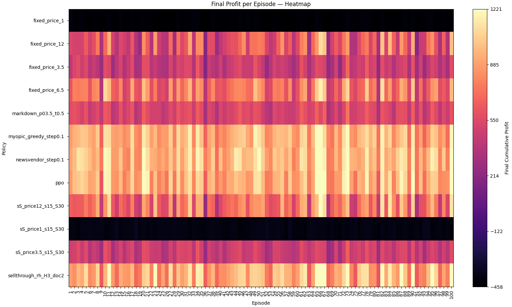
>Note. Heat map of cumulative profit for each episode by policy (rows) across episodes (columns). The colour encodes profit magnitude: greater variation indicates higher volatility in the policy's performance (greater cumulative profit std), while uniform rows denote more stable performance. Both PPO and Myopic policies consistently achieve the highest performance.

<center>
<h5>Figure 3 Average Final Profit per Policy For Perishable A</h5>
</center>

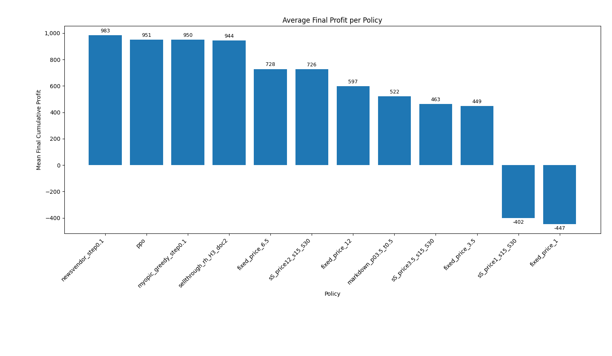
>Note. Mean end-of-horizon profit by policy (episode averages). Bars show the mean profit per policy; error bars indicate 95% confidence intervals. Each policy was evaluated over n episodes under identical seeds and settings (see Methods).

<center>
<h5>Table 1 Policy Level Averages Across Episodes For Perishable A</h5>
</center>

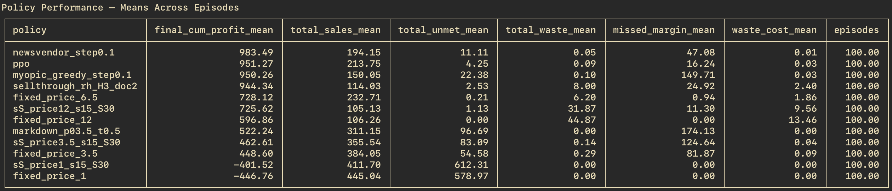
>Note. Episode-averaged means across independent simulation runs (n = 100 per policy). Profit is in currency units per episode; other metrics are in units. Policies were evaluated under Environment Config 1 (see Methods). Corresponding 95% confidence intervals for final cumulative profit are reported in Table 2.

<center>
<h5>Table 2 Error Metrics for Final Cumulative Profit (SE, MOE, 95% CI) For Perishable A</h5>
</center>

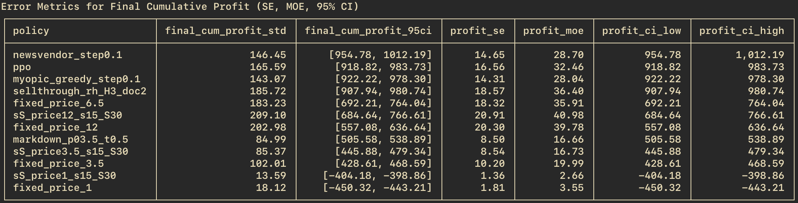

### 4.2 Perishable Type B

<center>
<h5>Figure 4 Final Profit Per Episode Heatmap For Perishable B</h5>
</center>

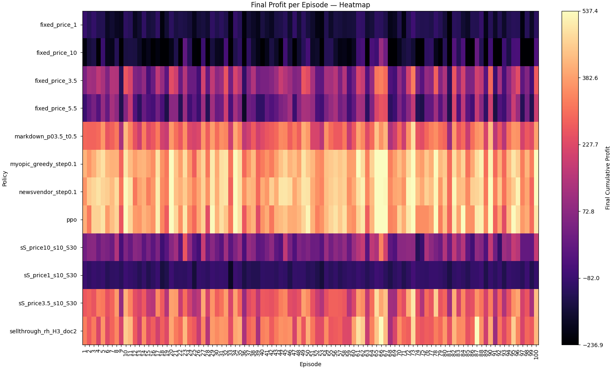
>Note. Same as Figure 2.

<center>
<h5>Figure 5 Average Final Profit per Policy For Perishable B</h5>
</center>

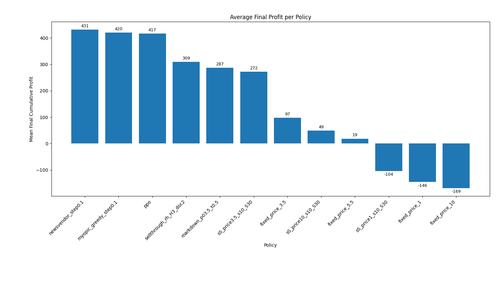
>Note. Same as Figure 3.

<center>
<h5>Table 3 Policy Level Averages Across Episodes For Perishable B</h5>
</center>

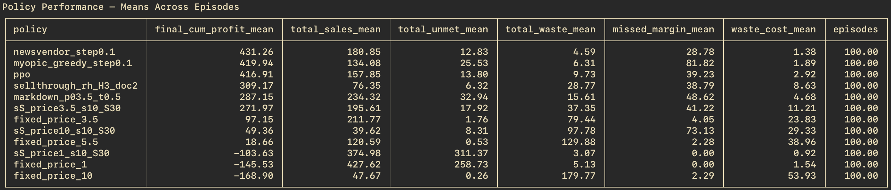
>Note. Same as Table 1.

<center>
<h5>Table 4 Error Metrics for Final Cumulative Profit (SE, MOE, 95% CI) For Perishable B</h5>
</center>

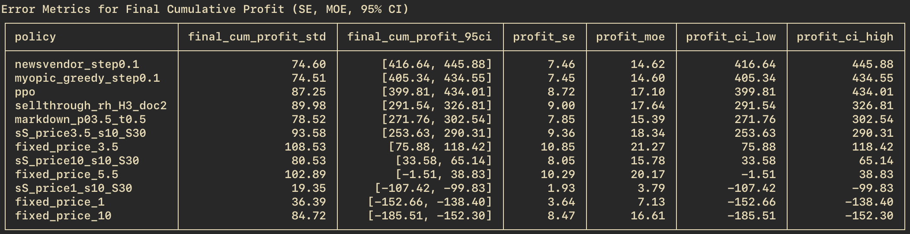
>Note. Same as Table 2.

---

## 5. Discussion

### 5.1 Results Discussion

From Table 1, the highest performing policies were as follows: newsvendor_step0.1 (\$983.49),  ppo (\$951.27), myopic_greedy_step0.1 (\$950.26), and sellthrough_rh_H3_doc2 (\$944.34). The remaining policies performed significantly worse than the top 4 policies ranking at:  fixed_price_6.5 (\$728.12), sS_price12_s15_S30 (\$725.62), fixed_price_12 (\$596.86), markdown_p03.5_t0.5 (\$522.24), sS_price3.5_s15_S30 (\$462.61), fixed_price_3.5 (\$448.60). The final two policies were unable to generate a profit and were as follows: sS_price1_s15_S30 (−\$401.52) and fixed_price_1 (−\$446.76). Additionally, the policies that prioritised low prices also ranked highest in sales volume: fixed_price_1 (445.04) and sS_price1_s15_S30 (411.70). For the highest-profit-yielding policies, the mean sales volume was as follows: ppo (213.75), newsvendor_step0.1 (194.15), myopic_greedy_step0.1 (150.05), and sellthrough_rh_H3_doc2 (114.03). Furthermore, the mean unmet demand for this environment was lowest for fixed_price_12 (0.00), fixed_price_6.5 (0.21), and sS_price12_s15_S30 (1.13). Both sellthrough_rh_H3_doc2 (2.53) and ppo (4.25) also maintained low unmet demand, whereas the following had the highest unmet demand: sS_price1_s15_S30 (612.31) and fixed_price_1 (578.97). The generated waste from the policies ranged from 0.00 (markdown_p03.5_t0.5) up to 44.87 (fixed_price_12).

Uncertainty for profit is summarized in Table 2. The 95% confidence intervals for the four top performing policies was as follows [\$954.78, \$1012.19] (newsvendor_step0.1), [\$918.82, \$983.73] (ppo), [\$922.22, \$978.30] (myopic_greedy_step0.1) and [\$907.94, \$980.74] (sellthrough_rh_H3_doc2). Within the final remaining policies the upper bounds were at or below \$764.04 (fixed_price_6.5) and 766.61 (sS_price12_s15_S30), and declined further for following policies. A negative interval was reached by sS_price1_s15_S30 and fixed_price_1. All metrics and intervals in these two tables are computed over 100 episodes per policy.

From Table 3, the highest-performing policies were as follows: newsvendor_step0.1 (\$431.26), myopic_greedy_step0.1 (\$419.94), ppo (\$416.91), and sellthrough_rh_H3_doc2 (\$309.17). The remaining policies performed significantly worse than the top 4 policies, ranking as: markdown_p03.5_t0.5 (\$287.15), sS_price3.5_s10_S30 (\$271.97), and fixed_price_3.5 (\$97.15). The following policies could not generate a positive mean profit: sS_price1_s10_S30 (−\$103.63), fixed_price_1 (−\$145.53), and fixed_price_10 (−\$168.90). Similar to environment A, the low-price policies recorded the highest sales: fixed_price_1 (427.62) and sS_price1_s10_S30 (374.98). Among the top-performing policies, the mean sales were as follows: newsvendor_step0.1 (180.85), myopic_greedy_step0.1 (134.08), and ppo(157.85). The policies that best avoided stockouts were similar to environment A and ranked: fixed_price_10 (0.26), fixed_price_5.5 (0.53), and fixed_price_3.5 (1.76). Likewise, in the highest-performing policy group, unmet demand was: newsvendor_step0.1 (12.83), myopic_greedy_step0.1 (25.53), and ppo 13.80. The models' sustainability also matched the results recorded in environment A. The mean waste spanned from sS_price1_s10_S30 (3.07) to fixed_price_10 (179.77). The top-performing policies produced mean waste values of newsvendor_step0.1 (4.59), myopic_greedy_step0.1 (6.31), and ppo (9.73).

Error metrics for profit in Table 4 show the 95% confidence intervals for the three highest performing policies [\$416.64, \$445.88] (newsvendor_step0.1), [\$405.34, \$434.55] (myopic_greedy_step0.1) and [\$399.81, \$434.01] (ppo). The following policy, sellthrough_rh_H3_doc2, had a significant drop in the interval [291.54, 326.81]. The intervals continued to rapidly drop across the remaining policies, including negative intervals for sS_price1_s10_S30, fixed_price_1, and fixed_price_10. As with the first configuration, all metrics and intervals in these two tables are based on 100 episodes per policy.

Across both simulation environments, there is a strong correlation between policies that balance stocking and price-to-inventory signals. The policies that performed best in environment A also performed best in environment B (e.g., NewsvendorPolicy, MyopicGreedyPolicy, SellThroughRHPolicy, and the PPO policy). These policies, in addition to producing the highest mean profits (rewards), also demonstrate relatively low risk (tighter distribution around the mean profit). The results and behaviours created by these policies match what finite-horizon perishable pricing theory predicts: when the horizon shortens or the age of inventory increases, the optimal policy will reduce price to increase sell-through, while simultaneously balancing service levels (unmet demand) to avoid excessive lost margin from missed sales. Existing theory documents the intertemporal trade-off between stock, age of inventory, demand, and pricing, which was formalised in dynamic pricing models for stochastically demanded, horizon-constrained inventory (Gallego & Van Ryzin, 1994; Talluri & Van Ryzin, 2004/2005). In summary, the policies that best managed profit, reduced missed margins, and waste were those that could react to state (inventory, expiratory pressures, time left) and determine inventory pricing rules more efficiently than static rules, as evidenced by the results.

In environment B, the unit margin is lower and the item's shelf life is shorter compared to environment A. This reduces the maximum possible profit at the episode and also raises the 'cost of overage' inventory. As a result, the newsvendor critical fractile is effectively weighted down, favouring conservative policies. In the simulation results, this favouring of conservative policies is evident in lower mean profits and greater value from timed markdowns (see Table 3 and related CIs in Table 4). Modern literature on data-driven perishable models supports the idea that a joint pricing–ordering policy must learn/track environmental changes (e.g., margins, spoilage risk) because they shift the optimal sell-through path; policies that do so maintain performance as conditions shift (Keskin, Li, & Song, 2022).

The behaviour of the MarkdownExpiryPolicy and SellThroughRHPolicy in the results shows high throughput with mixed or mediocre profits. These effects are particularly noticeable under a shorter shelf life. These results capture a phenomenon in retail: markdowns reliably raise sales but can reduce actual margin if the timing or depth is not correctly matched to elasticity and factors that drive conversion rates. Although the conversion rate in this simulation is driven by price, there are similarities between the theories of conversion rates affected by freshness and by pricing. The PPO policy can observe a fraction of expiring inventory, enabling it to make freshness-aware decisions. This rule is a central theme in empirical/optimisation work on clearance and freshness-aware pricing (Caro & Gallien, 2012). These models show that when the age of the inventory increases rapidly, steeper markdowns used earlier can reduce waste but still under-monetise demand if not tuned to the actual response curve. This pattern resembles the high sales but lower profit pattern visible in the results for the markdown-driven policies.

In contrast, all variants of the FixedPricePolicy and ThresholdRestockPolicy underperform in both simulations because they ignore either the pricing lever or the inventory's perishability/time state. This behaviour is consistent with modern revenue management and perishable inventory comparisons, where static policies are typically only effective under certain exceptional cases (Deniz, Karaesmen and Scheller-Wolf, 2020). The results demonstrate that the extremely low fixed-price variants produce the highest sales but cannot generate profits, whereas high fixed prices drive down sales, resulting in avoidable waste.

Another mechanism demonstrated by the differing approaches in the policies is the trade-off between learning dynamics and greediness. In short, this is a balance between making an optimal decision for the current period without considering future periods vs. considering the entire finite horizon (Besbes, Chaneton, and Moallemi, 2021). The PPO method learns effective decision policies while preventing significant updates via a clipped surrogate objective (Wang, He, and Tan, n.d.), thereby enabling the policy to learn stable improvements despite training in a partially observed, noisy environment (Schulman et al., 2017). In addition, the PPO actor observes inputs such as the expiring fraction of the inventory, foot traffic forecast, day of week, and remaining inventory capacity, which allow it to learn pricing paths that may result in lower immediate profit but favour higher profit across the episode. In contrast, the myopic policy favours short-term profit at the expense of higher unmet demand. 

Lastly, the PPO policy remained competitive with the top policies. This performance aligns with recent data-driven and deep-RL findings that joint pricing–ordering for perishables can be learned to near-optimality when the state encodes inventory age and time and when exploration is managed correctly (Balaji et al., 2019); studies report small optimality gaps versus dynamic-programming benchmarks and firm performance under changing environments (Nomura, Liu and Nishi, 2025).

### 5.2 User Manual

This section describes how to set up and use the pricing simulator environment.

### 5.2.1 Overview
**Interactive Simulator (Web UI)**
A gamified simulation that is designed for human interaction with the environment

### 5.2.2 Starting the Simulation

**1. Simulation Setup Screen**
After a user visits https://inventorysimulation.online in their browser, they will see the connecting screen and then the setup screen once the connection has been established.

<center>
<h5>Figure 6 UI Connection Screen</h5>
</center>


**2. Simulation Setup Screen**
The setup screen is divided into panels where a user can configure the environment:

<center>
<h5>Figure 7 UI Setup Screen</h5>
</center>


<u>Inventory & Costs</u>

<center>
<h5>Figure 8 Inventory & Cost UI</h5>
</center>

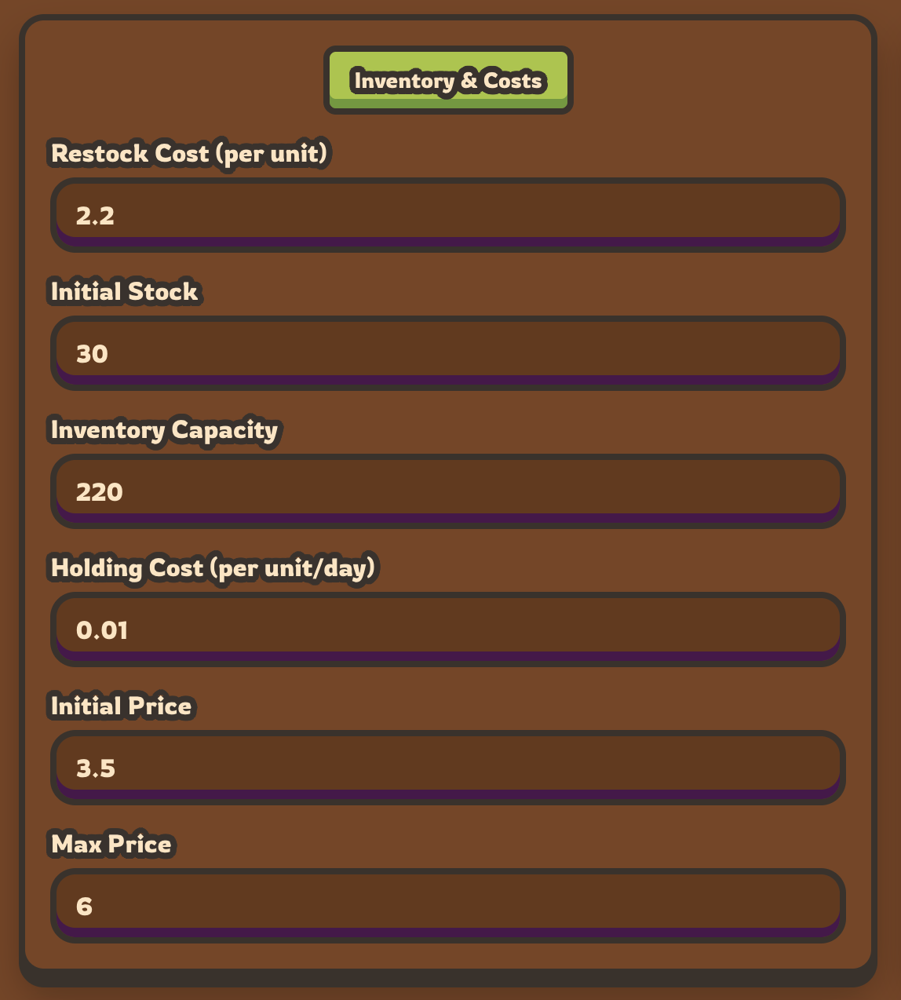

1. Restock Cost (per unit) – purchase cost of one unit.
2. Initial Stock – starting inventory at day 0.
3. Inventory Capacity – maximum number of units that can be held.
4. Holding Cost (per unit/day) – daily cost for each unit carried.
5. Initial Price – price on the first day.
6. Max Price – upper bound of the price slider during the simulation.


<u>Pricing & Shelf Life</u>

<center>
<h5>Figure 9 Price & Shelf UI</h5>
</center>


1. Product Shelf Life (days) – number of days before units expire.
2. Simulation Duration (days) – total number of simulated days.


<u>Foot Traffic</u>

<center>
<h5>Figure 10 Foot Traffic UI</h5>
</center>


1. Base Visitors – average daily customer arrivals.
2. Visitor Noise Std. Dev. – standard deviation of visitor noise.
3. Weekday Multipliers – relative traffic for each weekday.
4. High prices reduce foot traffic (checkbox) – if enabled, traffic is multiplicatively reduced when the price exceeds a pivot.
5. Traffic Pivot Price – price above which traffic begins to fall (visible only when the checkbox is enabled).


<u>Conversion Model</u>

<center>
<h5>Figure 11 Conversion Model UI</h5>
</center>

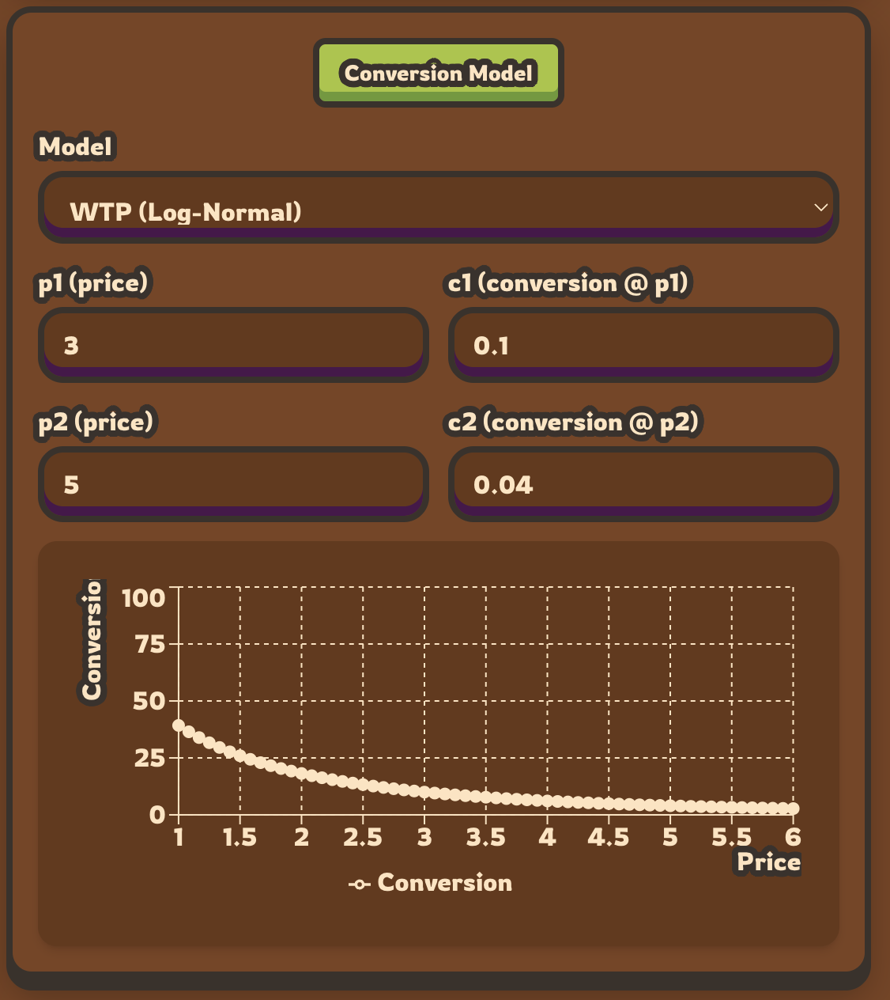

1. Model – choice of demand specification (WTP Log-Normal, Logit on log-price, Constant Elasticity, Linear, Exponential).
2. Depending on the model, additional calibration parameters appear (e.g., two-point calibration p1, c1, p2, c2 for WTP/logit; p0, c0, elasticity for constant elasticity).
3. A Conversion vs Price chart on the right visualises the implied conversion curve over the current price range.

<u>Demand Noise & Training</u>
<center>
<h5>Figure 12 Demand & Training UI</h5>
</center>


1. Noise Model – choice among Poisson, Binomial, and Negative Binomial.
2. NegBin k – overdispersion parameter (shown only for Negative Binomial).
3. Train AI Model (checkbox) – Whether to use PPO as a suggestive model, will fall back to Newsvendor otherwise.

<u>Starting Simulation</u>

<center>
<h5>Figure 13 Start Simulation UI</h5>
</center>


1. Pressing “START SIMULATION” will start the simulation.

**3. Day Screen (Daytime View)**
At each step in the simulation, a recap of what happened throughout the day will be shown on the daytime view screen.

<center>
<h5>Figure 14 UI Daily Screen</h5>
</center>


1. The header shows the store name (“RETRO MART”), the current day index, and whether the store is open or in planning mode.
2. The DAY SUMMARY panel aggregates key performance indicators via the KPISection component, including:
3. Daily profit and cumulative profit.
4. Foot traffic and units sold.
5. Restock and holding costs.
6. Any stockouts or waste.
7. Pressing the “NEXT” button swaps the interface into night mode.

**4. Night Screen (Planning / Restocking View)**
The night mode screen allows a user to enter the number of units to restock and adjust the selling price for the next day.

<center>
<h5>Figure 15 UI Night Screen</h5>
</center>


This screen is divided into the following:

<u>Controls</u>

<center>
<h5>Figure 16 Controls UI</h5>
</center>

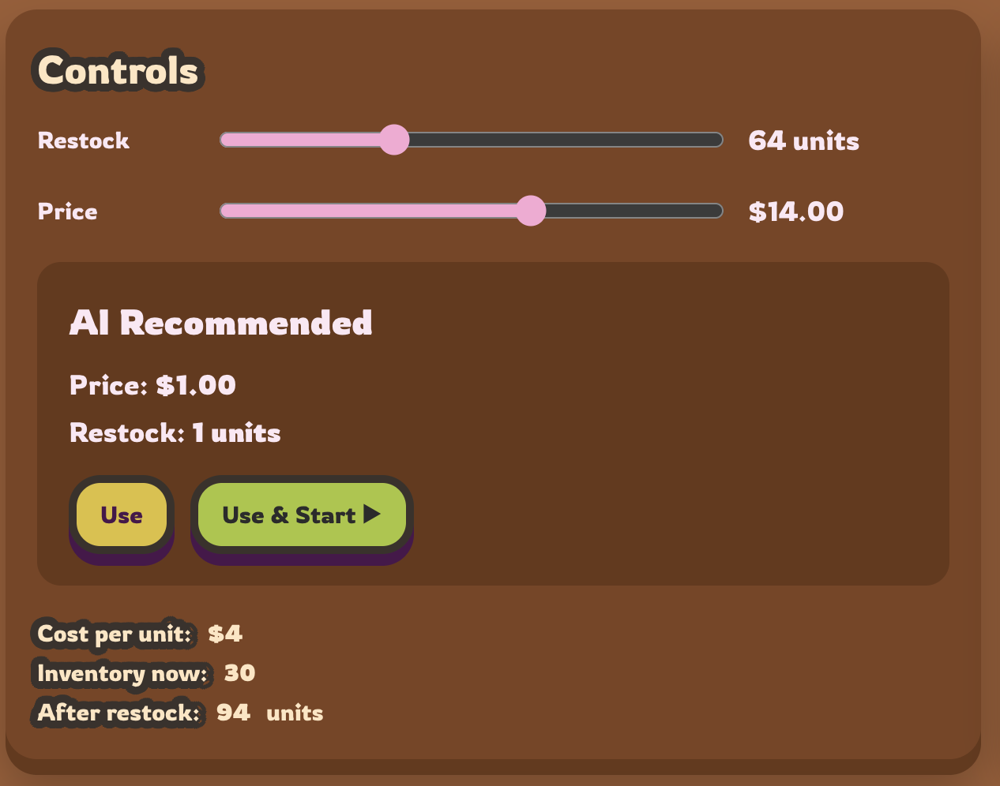

1. A Restock slider to enter the quantity of units to order.
2. A Price slider selects the selling price for the next day, bounded by the configured price range.
3. An AI Recommended card (optional) displays the AI-suggested price and restock:
4. Button "Use" copies the suggestions into the sliders.
5. Button "Use & Start" (when enabled) applies the suggestion and immediately advances to the next day.
6. A small text block below the sliders shows:
7. Cost per unit.
8. Current inventory.
9. Expected inventory after restocking.

<u>Inventory Batches</u>

<center>
<h5>Figure 17 Batches UI</h5>
</center>


1. The Inventory Batches panel lists all existing batches as separate rows and allows the user to see how close inventory is to expiring, helping with markdowns and restocking.

<u>Charts</u>

<center>
<h5>Figure 18 Charts UI</h5>
</center>

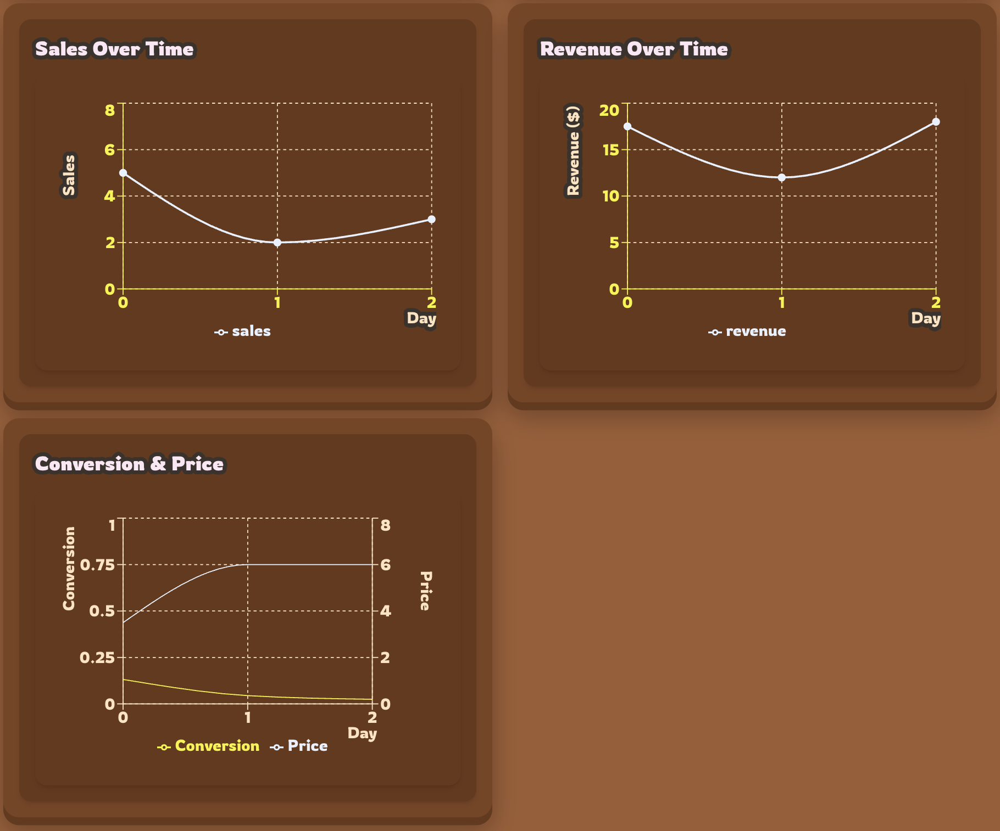

1. Sales Over Time – time series of daily demand/sales.
2. Revenue Over Time – time series of daily revenue.
3. Conversion & Price – plots the realised conversion rate against historical prices.

<u>Navigation Controls</u>

<center>
<h5>Figure 19 Navigation UI</h5>
</center>


1. The "BACK” button returns to the day summary for further inspection without taking any action.
2. The "START NEXT DAY" button confirms the selected price and restock quantity, advances the environment by one day, and returns to the day summary.
3. When the simulation ends, an Episode Complete overlay appears at the top of the interface, displaying the user's final profit. The user can dismiss this dialogue to continue exploring the charts.

<center>
<h5>Figure 20 UI Finished Screen</h5>
</center>


### 5.3 Implications
These results imply that, for perishable inventory within a fixed horizon, profit-maximising policies can dynamically manage pricing and restocking to achieve optimal outcomes (reduced waste, lower missed demand). Additionally, the simulation environment demonstrates its ability to capture the variables surrounding retailers' businesses realistically. In both simulation environments, multiple adaptive policies achieved the highest profits. Additionally, these policies are virtually indistinguishable at the 95% level, shown in Tables 2 and 4. As the end profit performance is so similar,  secondary criteria such as price smoothness, ease of implementation, or scalability can be considered without sacrificing performance. Given the realism and relative ease of implementing a simulation environment that represents a retailer's situation, retailers should consider modelling their own environment to benchmark which policies are most likely to succeed for them.

While the adaptive models were more straightforward to implement, they are more computationally intensive across longer periods and struggle to scale as more variables are considered in the environment. On the other hand, the RL policy was difficult to implement and tune; however, exposing the training-tuning weights and easily adjusting the observation vector make this policy potentially scalable across a range of environments. Although the RL policy was highly consistent, it occasionally produced episodes that significantly underperformed. I recommend using an RL model in addition to another adaptive model as a minimum performance threshold to prevent unacceptable performance.

### 5.4 Limitations & Challenges
The major limitation of this research is the RL model's inflexibility due to its current implementation and the simplifications made in the web simulation. Currently, the model must be trained on a single config and supports only one item type. This means the model must be retrained whenever the configuration is changed. Additionally, the training was not equal on all configs. Configs with sparse rewards (i.e., lower profit, more spread-out, lower demand) struggled to provide adequate signalling to the agent and stalled the learning process. Furthermore, the model's performance changed each time it was trained. For example, sometimes the model would be better at managing waste, profits, stockouts, etc., and other times it would not perform adequately. Tuning and reward shaping helped guide the agent in the right direction, so with further reward shaping, this issue could be mitigated better. Furthermore, selecting observations for the agent that enable the best action was challenging. Moving to a Recurrent PPO and observation history should be optimal in this scenario; however, I found no benefit from implementing them, and they significantly increased training time.

### 5.5 Ethics & sustainability
When considering a policy that optimises for a specific outcome, it is essential to assess the social impacts it may have. For example, by optimising only for profit, policies may put more pressure on consumers by increasing costs, clearing stock in unfair ways (deliberately understocking), etc. To avoid these consequences it is important to continue assessing their impacts and to tune them to adjust side effects.

---

## 6. Conclusion and Recommendations

The main goal of the current study was to benchmark classic policies against the RL (PPO) policy for a multi-period perishable inventory under stochastic demand using a gamified simulation environment. The results indicate that horizon-aware, joint price–order control policies best balance overage/underage costs, whereas greedy or rigid rules mismanage demand or spoilage. While there was no clear leader amongst the top policies in terms of raw performance, the RL policy offers significant fine-tuning and potential for improvement, making it hard not to recommend that retailers at least consider using it alongside their existing policies. Furthermore, the results align with expectations set by the existing literature, demonstrating that correctly implementing a simulated environment can mirror the selling conditions of a real retail environment.

**Recommendations**
To further improve both the policies and the gamified environment, future work is needed. Firstly, additional work should add more RL models and classic algorithms to the benchmark and improve the PPO model. Expanded work on the PPO model could include testing Recurrent PPO with an LSTM or observation stacking to help it 'observe' the environment more effectively. Additionally, instead of training the model for a single item type, it may make more sense to train across a wide variety of environment configs and item types to make the model more generic. Furthermore, the observation vector of the model could be expanded to include additional forecasting information. In addition to these model improvements, the gamified environment can be upgraded to reflect the realistic dynamics of an actual retailer. This may include additional distribution types for demand, price-sensitive foot traffic, expanding the profit calculation to include variable and fixed costs, etc. Additionally, the web UI could be improved to provide the user with better forecasting indicators, along with recommendations from multiple policies and their expected outcomes.

---

## 7. Communication Plan

| Stage                      | Purpose                                                                                           | Communication Channel(s)                                 | Frequency | Key Activities / Deliverables                                                                                   |
|----------------------------|---------------------------------------------------------------------------------------------------|----------------------------------------------------------|-----------|---------------------------------------------------------------------------------------------------------------|
| Finding supervisor    | Select project    | Project Match                                        | Once      | Approval of capstone topic and confirmation of supervisor                                                      |
| Proposal Approval        | Narrow scope to supervisors recommendation            | Canvas; Microsoft Teams private channel                  | Once   | Submitting the final proposal                                                 |
| Project Updates            | • Provide updates<br>• Discuss issues<br>• Confirm project meets requirements | MS Teams meetings    | Continued| Web UI prototypes; live simulation demonstration                                                                       |
| Project Submission       | • Get feedback<br>• Finialise final report draft                                            | MS Teams meetings         | Continued  | Present final version of web UI & final report                    |

---

## References

Aviv, Y. and Pazgal, A. (2008). Optimal Pricing of Seasonal Products in the Presence of Forward-Looking Consumers. Manufacturing & Service Operations Management, 10(3), pp.339–359. doi:https://doi.org/10.1287/msom.1070.0183.

Balaji, B., Bell-Masterson, J., Bilgin, E., Damianou, A., Garcia, P.M., Jain, A., Luo, R., Maggiar, A., Narayanaswamy, B. and Ye, C. (2019). ORL: Reinforcement Learning Benchmarks for Online Stochastic Optimization Problems. [online] arXiv.org. Available at: https://arxiv.org/abs/1911.10641 [Accessed 25 Oct. 2025].

Besbes, O., Chaneton, J.M. and Moallemi, C. (2021). The Exploration-Exploitation Trade-off in the Newsvendor Problem | Columbia Business School. [online] Columbia Business School. Available at: https://business.columbia.edu/faculty/research/exploration-exploitation-trade-newsvendor-problem [Accessed 25 Oct. 2025].

Bitran, G. and Caldentey, R. (2003). An Overview of Pricing Models for Revenue Management. Manufacturing & Service Operations Management, 5(3), pp.203–229. doi:https://doi.org/10.1287/msom.5.3.203.16031.

Chen, W., Liu, H. and Xu, D. (2018). Dynamic Pricing Strategies for Perishable Product in a Competitive Multi-Agent Retailers Market. Journal of Artificial Societies and Social Simulation, 21(2). doi:https://doi.org/10.18564/jasss.3710.

Deniz, B., Karaesmen, I. and Scheller-Wolf, A. (2020). A comparison of inventory policies for perishable goods. Operations Research Letters, 48(6), pp.805–810. doi:https://doi.org/10.1016/j.orl.2020.09.005.

Elmaghraby, W. and Keskinocak, P. (2003). Dynamic Pricing in the Presence of Inventory Considerations: Research Overview, Current Practices, and Future Directions. Management Science, 49(10), pp.1287–1309. doi:https://doi.org/10.1287/mnsc.49.10.1287.17315.

Ferreira, K., Simchi-Levi, D. and Stewart, H. (n.d.). Online Network Revenue Management using Thompson Sampling He Wang.

Gallego, G. and van Ryzin, G. (1994). Optimal Dynamic Pricing of Inventories with Stochastic Demand over Finite Horizons. Management Science, 40(8), pp.999–1020. doi:https://doi.org/10.1287/mnsc.40.8.999.

Hayward, B. (2025). New Impact Report reveals: Australian Food Businesses Cut Food Waste by 13%, with CO2 Reduction From Landfill Equal to 200,000 Cars off the Road   - End Food Waste Australia. [online] End Food Waste Australia. Available at: https://endfoodwaste.com.au/australian-food-businesses-cut-food-waste-by-13-with-co2-reduction-from-landfill-equal-to-200000-cars-off-the-road/.

Jo, S., Lee, G.M. and Moon, I. (2024). Airline dynamic pricing with patient customers using deep exploration-based reinforcement learning. Engineering applications of artificial intelligence, 133, pp.108073–108073. doi:https://doi.org/10.1016/j.engappai.2024.108073.

Keskin, N.B., Li, Y. and Song, J.-S. (2022). Data-Driven Dynamic Pricing and Ordering with Perishable Inventory in a Changing Environment. Management Science. doi:https://doi.org/10.1287/mnsc.2021.4011.

Kummu, M., de Moel, H., Porkka, M., Siebert, S., Varis, O. and Ward, P.J. (2012). Lost food, wasted resources: Global food supply chain losses and their impacts on freshwater, cropland, and fertiliser use. Science of The Total Environment, 438(1), pp.477–489. doi:https://doi.org/10.1016/j.scitotenv.2012.08.092.

Nahmias, S. (1982). Perishable Inventory Theory: A Review. Operations Research, 30(4), pp.680–708. doi:https://doi.org/10.1287/opre.30.4.680.

Nomura, Y., Liu, Z. and Nishi, T. (2025). Deep Reinforcement Learning for Dynamic Pricing and Ordering Policies in Perishable Inventory Management. Applied Sciences, 15(5), pp.2421–2421. doi:https://doi.org/10.3390/app15052421.

Nowak, M. and Pawłowska-Nowak, M. (2024). Dynamic Pricing Method in the E-Commerce Industry Using Machine Learning. Applied Sciences, [online] 14(24), pp.11668–11668. doi:https://doi.org/10.3390/app142411668.

Perakis, G. and Roels, G. (2007). The Price of Anarchy in Supply Chains: Quantifying the Efficiency of Price-Only Contracts. Management Science, 53(8), pp.1249–1268. doi:https://doi.org/10.1287/mnsc.1060.0656.

Poore, J. and Nemecek, T. (2018). Reducing Food’s Environmental Impacts through Producers and Consumers. Science, 360(6392), pp.987–992. doi:https://doi.org/10.1126/science.aaq0216.

Riesenegger, L. and Hübner, A. (2022). Reducing Food Waste at Retail Stores—An Explorative Study. Sustainability, [online] 14(5), p.2494. doi:https://doi.org/10.3390/su14052494.

Sanders, R.E. (2023). Dynamic Pricing and Organic Waste Bans: A Study of Grocery Retailers’ Incentives to Reduce Food Waste. Marketing Science, 43(2). doi:https://doi.org/10.1287/mksc.2020.0214.

Schulman, J., Wolski, F., Dhariwal, P., Radford, A. and Klimov, O. (2017). Proximal Policy Optimization Algorithms. [online] arXiv.org. Available at: https://arxiv.org/abs/1707.06347.

Schweitzer, M.E. and Cachon, G.P. (2000). Decision Bias in the Newsvendor Problem with a Known Demand Distribution: Experimental Evidence. Management Science, 46(3), pp.404–420. doi:https://doi.org/10.1287/mnsc.46.3.404.12070.

Talluri, K. and van Ryzin, G. (2004). Revenue Management Under a General Discrete Choice Model of Consumer Behavior. Management Science, 50(1), pp.15–33. doi:https://doi.org/10.1287/mnsc.1030.0147.

Teller, C., Holweg, C., Reiner, G. and Kotzab, H. (2018). Teller Holweg Reiner Kotzab 2018. [online] ResearchGate. Available at: https://www.researchgate.net/publication/326683554_Teller_Holweg_Reiner_Kotzab_2018.

Wang, Y., He, H. and Tan, X. (n.d.). Truly Proximal Policy Optimization.

Yavuz, T. and Kaya, O. (2024). Deep reinforcement learning algorithms for dynamic pricing and inventory management of perishable products. Applied Soft Computing, 163, p.111864. doi:https://doi.org/10.1016/j.asoc.2024.111864.

Zhang, H., Zhang, Z. and Zhang, J. (2021). A Risk-Averse Newsvendor Model under Stochastic Market Price. Discrete Dynamics in Nature and Society, 2021, pp.1–9. doi:https://doi.org/10.1155/2021/9967359.

Zhao, W. and Zheng, Y.-S. (2000). Optimal Dynamic Pricing for Perishable Assets with Nonhomogeneous Demand. Management Science, 46(3), pp.375–388. doi:https://doi.org/10.1287/mnsc.46.3.375.12063.

---

## Use Of AI In this report

GenAI was used to do the following:
1. Convert policy code into generic pseudocode to be shown in the report.
2. Help generate Python scripts that were used for graphing.
3. Assist with the LaTeX formula notation.
4. Provide spell checking and grammar corrections. 

---

## Appendices

<center>
<h5>Listing 5 Configuration used for simulation A</h5>
</center>

```py
dict(
    max_days=30,
    initial_inventory=30,
    expiration_days=6,
    restock_cost=2.0,
    holding_cost=0.5,
    waste_cost=0.3,
    base_demand=50,
    price_range=(1.0, 12.0),
    max_restock=15,
    inventory_capacity=30,
    initial_price=3.5,
    demand_config=dict(
        traffic=dict(
            base=50,
            weekdayMultipliers=[0.9,0.9,1.0,1.0,1.1,1.3,1.4],
            weekdayStart="Mon",
            visitorNoiseStd=40.0,
            priceTrafficCut=False,
            priceTrafficDelta=15.0,
        ),
        conversion=dict(
            model="wtpLogNormal",
            p1=6.0, c1=0.15,
            p2=10.0, c2=0.08,
            p0=10.0, c0=0.20, elasticity=-0.5,
            linearPriceCoeff=1.0,
            expElasticity=0.05,
        ),
        noise=dict(model="poisson", negbinK=5.0),
    ),
)
```

<center>
<h5>Listing 6 Configuration used for simulation B</h5>
</center>

```py
dict(
    max_days=30,
    initial_inventory=30,
    expiration_days=3,
    restock_cost=1.2,
    holding_cost=0.5,
    waste_cost=0.3,
    base_demand=50,
    price_range=(1.0, 10.0),
    max_restock=15,
    inventory_capacity=30,
    initial_price=3.5,
    demand_config=dict(
        traffic=dict(
            base=50,
            weekdayMultipliers=[0.9,0.9,1.0,1.0,1.1,1.3,1.4],
            weekdayStart="Mon",
            visitorNoiseStd=40.0,
            priceTrafficCut=False,
            priceTrafficDelta=15.0,
        ),
        conversion=dict(
            model="wtpLogNormal",
            p1=3.0, c1=0.15,
            p2=5.0, c2=0.08,
            p0=10.0, c0=0.20, elasticity=-0.5,
            linearPriceCoeff=1.0,
            expElasticity=0.05,
        ),
        noise=dict(model="poisson", negbinK=5.0),
    ),
)
```

